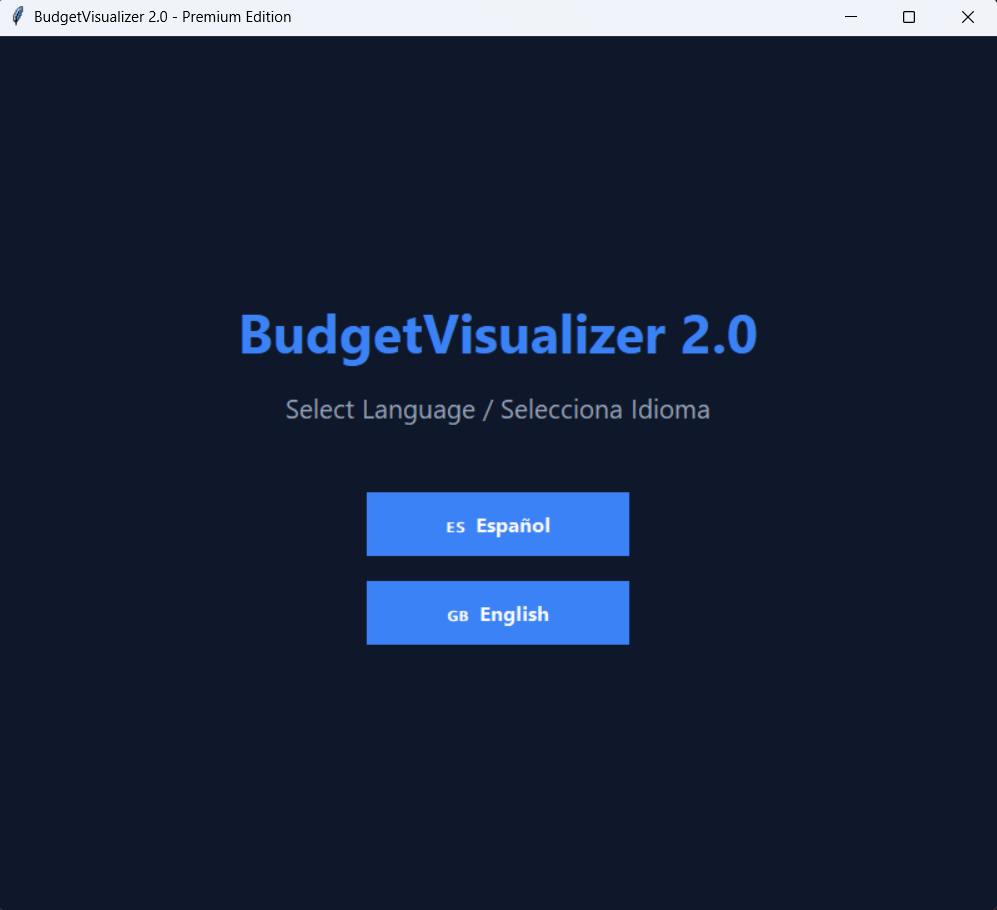
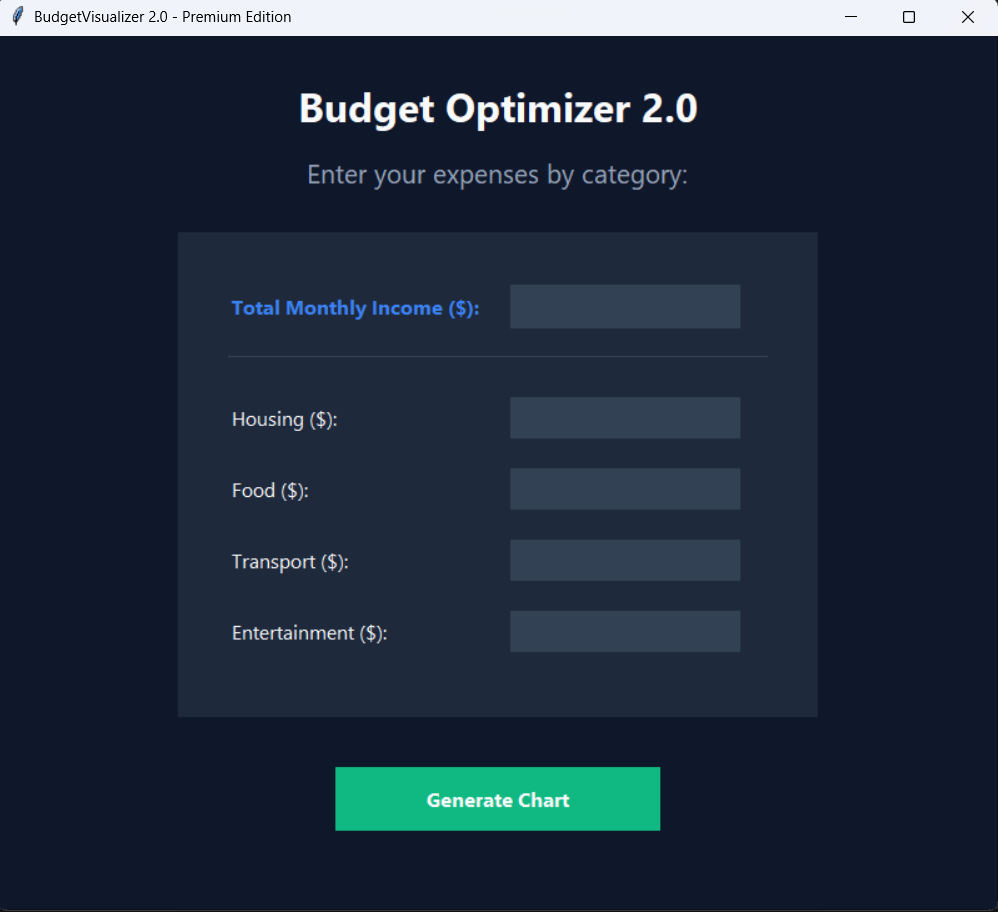
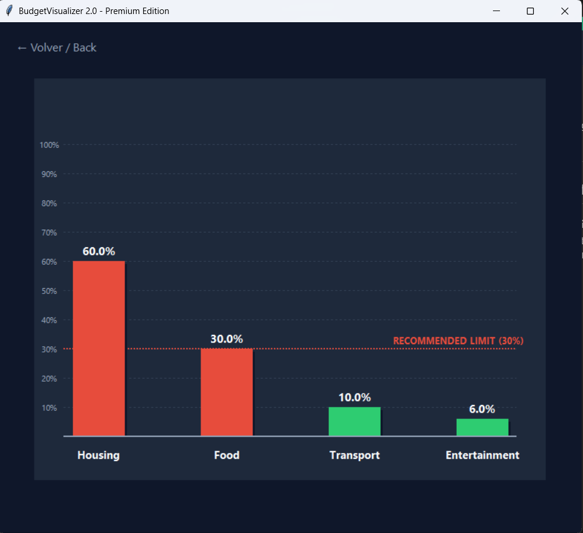

# BudgetVisualizer 📊
## By: Jaren Pazmino

[](https://www.python.org/)
[]()
[](https://codeinplace.stanford.edu/)
[](https://github.com/JarenPOL1015/budget_visualizer/releases/tag/v1.0.0)
[](https://github.com/JarenPOL1015/budget_visualizer/releases)

An elegant financial dashboard built entirely in Python using native components. This application transforms raw income and expense data into high-fidelity visual representations, employing color psychology and behavioral heuristics to flag high-risk financial choices. Developed as a Final Project for **Stanford University's Code in Place**.

---

## 🚀 Quick Start & Releases

To make testing seamless for evaluators and users, this project features pre-compiled standalone executables (`.exe`) that require **no Python installation or terminal setups**.

### 📥 Stable Releases
* **[Latest] Premium GUI Edition (v2.0.0 .exe):** Available now in the [Releases Section](https://github.com/JarenPOL1015/budget_visualizer/releases)! Download `BudgetVisualizer_GUI.exe`—a single, standalone binary compiled with PyInstaller (`--onefile`). No installations or folders required. Double-click and launch the full immersive dark-mode workspace instantly.
* **Console Edition (v1.0.0 .exe):** Available in the [Releases Section](https://github.com/JarenPOL1015/budget_visualizer/releases/tag/v1.0.0). Run the lightweight stable application instantly via your native desktop terminal wrapper.

---

## 🌟 Key Features

* **Dual-Engine Architecture:** Features both a lightweight terminal setup (v1.0.0) and a premium standalone Dark Mode dashboard (v2.0.0).
* **Fintech Dark Mode Aesthetics:** Built with custom flat buttons, responsive hover events, deep slate panels (`#0f172a`), and clear typographic structures—completely hiding the background terminal.
* **Decoupled Architecture (i18n):** Complete localized string mapping isolated inside an independent `translations.py` file. The interface shifts dynamically between **English** and **Español** during the onboarding screen.
* **Robust Input Layer & Validations:** Safe float conversions protected by internal error-handling frameworks. Empty fields gracefully default to zero, preventing software crashes, and syntax errors trigger native GUI alert dialogs.
* **Proportional Scaling with Chart Grids:** Custom canvas with structural reference gridlines ($10\%$ to $100\%$) and automated bar shadow depth effects based on the **30% Financial Alert Rule**.

---

## 📁 Repository Structure

```text
├── budget_gui.py       # Premium View Engine & Controller (Tkinter implementation)
├── translations.py     # Independent Data Layer containing localized text maps
└── README.md           # Documentation, release logs, and showcase manual
```

---

## 🛠️ Advanced Source Execution (Developers Only)

If you prefer to run or modify the source code instead of using our standalone releases:

1. Ensure you have **Python 3.8+** installed on your desktop.
2. Clone this repository:
```bash
git clone https://github.com/JarenPOL1015/budget_visualizer.git
cd budget_visualizer
```
3. Run the GUI script:
```bash
python budget_gui.py
```

---

## 🖼️ Premium Visual Flow

Take a look at the application's multi-screen state transitions:

### 1. Onboarding & Routing

Choose your preferred language context upon application startup.


### 2. Secure Financial Form

Enter your financial parameters inside the contextualized card form.


### 3. Smart Analytics Canvas

Get immediate risk-threshold data via dynamic green/red color shifts.


---

## 💡 Architectural Insights (Stanford Design Philosophy)

This version completely embraces the **Model-View-Controller (MVC)** concept. By keeping the text data in `translations.py` (Model) separate from the interface loops in `budget_gui.py` (View/Controller), the codebase remains incredibly scalable, making it trivial to add new language modules or financial parameters in the future.

---

## 👥 Author
- Jaren Pazmino

   Member of the Polytechnic Artificial Intelligence Club (CIAP)


